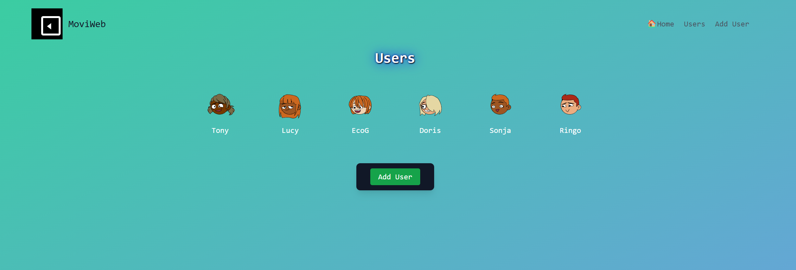

# MoviWeb - A simple Web Movie Library

## 🎬 About MoviWeb

MoviWeb is a Flask and SQLAlchemy web application designed to help users curate and manage their personal movie library. 
A user can create his/her personal collection of favorite movies. He/she can add movies, update them, delete them, 
and explore additional movie information fetched dynamically via the OMDb API. Users Avatars come from the Dicebear API.

This project utilizes SQLAlchemy for database management, Flask for backend routing, and a combination of CSS and (mostly) Tailwind CSS for a modern and clean UI.

## Features

- 📝 **User Management:** Each user can create his own personal movie collection.
- 🎞️ **Movie Collection:** Users can add movies to their library by title, with all other info and poster automatically retrieved from OMDb.
- 🛠️ **Editing & Deleting:** Users can update or remove movies from their list.
- 🔥 **Dynamic UI:** A fully responsive, clean design using Tailwind CSS.
- 🌍 **API Support:** Provides RESTful API endpoints to fetch user and movie data.

## Technologies Used

- **Backend:** Flask, SQLAlchemy
- **Frontend:** Jinja2, Tailwind CSS
- **Database:** SQLite
- **API Integration:** OMDb API, Dicebear API

## 🛠 Installation & Setup

### 1️⃣ Clone the Repository

```bash
 git clone https://github.com/EcoG-One/moviweb_app.git
```

### 2️⃣ Create a Virtual Environment & Install Dependencies

```bash
 python -m venv .venv
 source .venv/bin/activate  (On Windows use: .venv\Scripts\activate)
 pip install -r requirements.txt
```

### 3️⃣ Set Up Environment Variables

Create a `.env` file and set up your OMDb API key:

```ini
OMDB_API_KEY=your_api_key
FLASK_APP=app.py
FLASK_ENV=development
```

### 4️⃣ Initialize the Database

```bash
 flask db init
 flask db migrate -m "Initial migration."
 flask db upgrade
```

### 5️⃣ Run the Application

```bash
 flask run
```

The app should now be available at [http://localhost:5000](http://127.0.0.1:5000) 

## 📡 API Endpoints

MoviWeb provides RESTful API access to its data:

| Method | Endpoint                      | Description                      |
| ------ | ----------------------------- | -------------------------------- |
| GET    | `/api/users`                  | Fetch all users                  |
| GET    | `/api/users/<user_id>/movies` | Get movies for a user            |
| GET    | `/api/movies/<movie_id>`      | Get details for a specific movie |

## 🛠️ Contribution

Want to improve MovieWeb? Contributions are welcome!

1. Fork the repository
2. Create a new branch 
3. Commit your changes
4. Push to the branch and open a PR


## 📸 Screenshots

### 🏠 Homepage


### 🎞 Users Page


### 🎞️ User Movies Page


